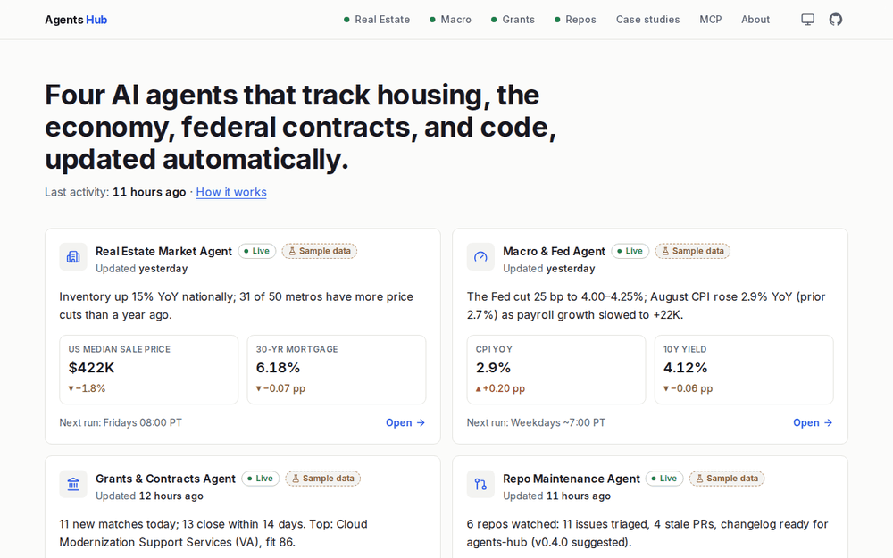
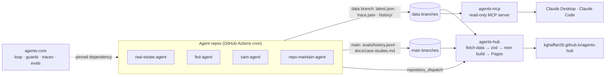

# Agents Hub

**Four autonomous AI agents that track housing, the economy, federal contracts, and code — updated on a schedule, with every number sourced and every LLM dollar published.**

This repo is the website: a static Next.js site on GitHub Pages that assembles the JSON each agent publishes and turns it into dashboards. No server, no database, no secrets in the browser.



## Highlights

- **Agents that investigate, not just summarize.** Budgeted tool-use loops ([agents-core](https://github.com/Kghaffari26/agents-core) `AgentLoop`) explain the week's anomalies: why a metro's inventory surged ([real-estate-agent](https://github.com/Kghaffari26/real-estate-agent)), what's driving a CPI or payrolls move ([fed-agent](https://github.com/Kghaffari26/fed-agent)), who holds the incumbent contract and what comparable awards went for on USAspending ([sam-agent](https://github.com/Kghaffari26/sam-agent)).
- **A human stays in the loop for writes.** [repo-maintain-agent](https://github.com/Kghaffari26/repo-maintain-agent) drafts fixes for triaged bugs and runs the tests, but opening the PR is an approval-gated tool: the site shows each as **Draft PR — awaiting human review** with the full diff.
- **Every run is traced.** Each agent page has a **Run trace** panel: every LLM call, tool call, HTTP request and number-guard retry with latency and cost, as a collapsible timeline or a plain table (from agents-core v0.3.0's `trace.json`).
- **Evals on every prompt change.** Each agent's `evals/history.jsonl` is charted on its page and on [/about](https://kghaffari26.github.io/agents-hub/about/); a regression fails the agent's PR.
- **Numbers come from code.** A number guard rejects narrative citing a number the code didn't compute, retries once, then falls back to a labeled template.
- **Ask Claude directly.** [agents-mcp](https://github.com/Kghaffari26/agents-mcp) is a read-only MCP server over the same data; [/mcp](https://kghaffari26.github.io/agents-hub/mcp/) has install snippets and example conversations. Write-ups of real runs are on [/case-studies](https://kghaffari26.github.io/agents-hub/case-studies/).
- **Costs in the open.** Per-run budget caps, cached LLM calls and the Batch API keep runs to cents, and every run's cost is published (per span in the trace, per agent on [/about](https://kghaffari26.github.io/agents-hub/about/)).

| Section                                                              | What it shows                                                                                                                             | Agent repo                                                                |
| -------------------------------------------------------------------- | ----------------------------------------------------------------------------------------------------------------------------------------- | ------------------------------------------------------------------------- |
| [Real Estate](https://kghaffari26.github.io/agents-hub/real-estate/) | 50 U.S. metros: compare up to 3, metric toggles, mortgage-rate overlay, map, movers, alerts, market temperature, affordability calculator | [real-estate-agent](https://github.com/Kghaffari26/real-estate-agent)     |
| [Macro](https://kghaffari26.github.io/agents-hub/macro/)             | Regime strip, 24 indicators with revision badges, yield curve, FOMC decision + word-level statement diff                                  | [fed-agent](https://github.com/Kghaffari26/fed-agent)                     |
| [Grants](https://kghaffari26.github.io/agents-hub/grants/)           | SAM.gov / Grants.gov matches scored against a business profile; filterable table with CSV export; deadline timeline                       | [sam-agent](https://github.com/Kghaffari26/sam-agent)                     |
| [Repos](https://kghaffari26.github.io/agents-hub/repos/)             | Health scores, triage queue, stale PRs with nudges, changelog drafts, actions log                                                         | [repo-maintain-agent](https://github.com/Kghaffari26/repo-maintain-agent) |

Every agent page also has its latest **agentic output** (metro investigations, "what's driving this", bid-research briefs, fix proposals), a **Run trace** panel and an **Evals** section. [Case studies](https://kghaffari26.github.io/agents-hub/case-studies/) aggregates each agent repo's `docs/case-studies.md`, and [MCP](https://kghaffari26.github.io/agents-hub/mcp/) explains [agents-mcp](https://github.com/Kghaffari26/agents-mcp).

All four agents are built on [agents-core](https://github.com/Kghaffari26/agents-core): HTTP caching, a per-run LLM budget cap, a number guard that rejects narrative citing numbers the code didn't compute, and the data-branch publisher.

## Screenshots

| Overview                                   | Real estate explorer                             |
| ------------------------------------------ | ------------------------------------------------ |
|  |  |
| **Macro (dark)**                           | **FOMC statement diff**                          |
|        |      |
| **Grants**                                 | **Repos (dark)**                                 |
|      |              |


## Architecture

| Repo                                                                      | Role                                                                                                                                     |
| ------------------------------------------------------------------------- | ---------------------------------------------------------------------------------------------------------------------------------------- |
| [agents-core](https://github.com/Kghaffari26/agents-core)                 | Shared Python package: runner, HTTP cache, budgets, number guard, `AgentLoop`, tracing, evals, data-branch publisher, reusable workflows |
| [real-estate-agent](https://github.com/Kghaffari26/real-estate-agent)     | 50 metros from Redfin, Zillow, FRED, Census; briefs; metro investigations                                                                |
| [fed-agent](https://github.com/Kghaffari26/fed-agent)                     | ~24 FRED indicators, yield curve, FOMC diff and read; "what's driving this"                                                              |
| [sam-agent](https://github.com/Kghaffari26/sam-agent)                     | SAM.gov / Grants.gov screening and scoring; bid research from USAspending                                                                |
| [repo-maintain-agent](https://github.com/Kghaffari26/repo-maintain-agent) | Repo health, triage, stale PRs, changelogs; fix proposals behind human approval                                                          |
| [agents-mcp](https://github.com/Kghaffari26/agents-mcp)                   | Read-only MCP server over the agents' data branches, for Claude and other MCP clients                                                    |
| [agents-hub](https://github.com/Kghaffari26/agents-hub) (this repo)       | The static site: fetch, validate, render, deploy                                                                                         |



```
agent repos (Python, GitHub Actions cron)              agents-hub (this repo)
┌───────────────────────────────┐                      ┌──────────────────────────────────────────┐
│ real-estate-agent  (Fridays)  │  force-push          │ scripts/fetch-data.mjs                   │
│ fed-agent          (weekdays) │  `data` branch  ───▶ │   raw.githubusercontent.com/<repo>/data  │
│ sam-agent          (daily)    │                      │   → public/data/<agent>/  (zod-checked)  │
│ repo-maintain-agent(daily)    │  repository_dispatch │   → manifest.json + costs/summary.json   │
└───────────────────────────────┘  agent-data-updated  │   (fixtures + "Sample data" if missing)  │
                                   ───────────────────▶│ next build (static export) → out/        │
                                                       │ lint · vitest · Playwright + axe · LHCI  │
                                                       │ deploy-pages → GitHub Pages /agents-hub  │
                                                       └──────────────────────────────────────────┘
```

- **Data contract.** Each agent's `data` branch holds `latest.json`, agent-specific files (`metros/<slug>.json`, `all.json`), `history/`, `manifest-entry.json`, `costs-summary.json` and `schema.json` ([agents-core README](https://github.com/Kghaffari26/agents-core#the-data-branch-contract)). The shapes are §6 of each agent spec in [`docs/specs/`](docs/specs/). The site validates every file with zod (`src/lib/schemas/`); build-time loaders throw an error naming the file and field.
- **`meta` = agents-core `RunMeta`.** Every `latest.json` starts with agents-core's `RunMeta` (v0.1.0, `schema_version` 1.0.0). The site accepts any `1.x` schema_version, optional `warnings`, and extra agent-specific meta keys (agents-core v0.2.0); only a new major is rejected. The §6 bodies stay exact.
- **Validated against real output.** `test/fixtures/real/<agent>/` holds trimmed copies of real runs of all four agents; the contract tests keep the site's zod schemas in step with what agents actually publish.
- **Never blocked by an agent.** If a data branch is missing or a file fails its contract, `fetch-data` uses that agent's committed fixtures (`test/fixtures/<agent>/`) and the UI shows a **Sample data** badge on that section. The build log says exactly why, per agent (missing repo/branch/file, HTTP or network error, or the failing zod path), ends with a live/sample summary table (also in the Actions job summary), and `public/data/_fetch-report.json` records the same.
- **Agentic additions, read tolerantly.** `trace.json` (agents-core v0.3.0), `manifest-entry.json`'s `trace_summary`, and each agent's §6.x fields (real estate `investigations`, macro `investigation`, grants `top_matches[].bid_research`, repo `fix_proposals`) are optional: older runs render without them, and a malformed one is dropped with a warning in the fetch log instead of sending the agent to sample data. Shapes: [`docs/specs/AGENTIC_ADDITIONS.md`](docs/specs/AGENTIC_ADDITIONS.md).
- **Evals and case studies come from `main`.** `fetch-data` reads each repo's `evals/history.jsonl` (plus agents-mcp's) and `docs/case-studies.md` from its default branch, falling back per file to committed samples (`test/fixtures/evals/`, `test/fixtures/case-studies/`) with a **Sample** badge.
- **Build-time vs lazy data.** Headline numbers and briefs render into HTML at build time; per-metro series, the full grants table and 10-year macro series load client-side on demand through `dataUrl()` (basePath-aware).
- **Performance.** Recharts and Leaflet are code-split and load after first paint; mobile Lighthouse (local, gzip, simulated 4G): 99 on `/`, 92–98 on `/real-estate`, 95+ elsewhere.

### Layout

```
config/sources.json        where each agent publishes (order = overview cards)
scripts/fetch-data.mjs     download data branches → public/data (fixture fallback, reasons + summary table)
scripts/validate-data.mjs  check a local data-branch folder against the site's contracts (all issues)
scripts/trim_real_fixture.py  copy a real agent run into test/fixtures/real/ (trimmed)
scripts/gen-types.mjs      schema.json → src/types/generated + src/lib/validators/generated
scripts/gen_fixtures.py    deterministic, realistic fixtures for all four agents
scripts/gen-og.mjs         OG images (satori + resvg) · gen-sitemap.mjs · serve-out.mjs
scripts/gen_agentic_fixtures.py  sample traces, §6.x fields, eval histories and case studies (run by gen_fixtures.py)
scripts/record-tour.mjs    the README hero GIF (Playwright screenshots → ffmpeg, < 3 MB)
src/app/                   routes: /, /real-estate, /real-estate/[slug], /macro, /grants, /repos, /case-studies, /mcp, /about
src/components/            shell · common · overview · real-estate · macro · grants · repos · trace · evals · agentic · mcp · case-studies · about
src/lib/                   schemas (zod contracts) · data loaders · format · mortgage · urlState · csv · colors
test/                      unit + component + contract tests, fixtures, broken fixtures
e2e/                       Playwright flows + axe on every route in both themes
```

## Develop

```bash
npm ci
npm run fetch-data      # live data branches; falls back to fixtures per agent
npm run dev             # http://localhost:3000
npm test                # vitest (unit, component, contract)
npm run build           # static export to out/
npm run e2e             # Playwright + axe against out/
npm run lint            # eslint + prettier
npm run gen:fixtures    # regenerate test/fixtures (python3)
node scripts/validate-data.mjs grants ../sam-agent/public-data     # does a real run match the site's contract?
node scripts/fetch-data.mjs --local grants=../sam-agent/public-data # build with a local run (others as usual)
node scripts/fetch-data.mjs --local-repo grants=../sam-agent       # evals/case studies from a local checkout
BASE_PATH=/agents-hub npm run build && BASE_PATH=/agents-hub npm run e2e   # reproduce GitHub Pages paths
FFMPEG=$(python3 -c "import imageio_ffmpeg as f; print(f.get_ffmpeg_exe())") node scripts/record-tour.mjs  # re-record docs/hero.gif
```

Adding a fifth agent: an entry in `config/sources.json`, a fixture folder, a zod schema in `src/lib/schemas/`, a route, and a line in `src/lib/nav.ts`.

## Deploy

`.github/workflows/deploy.yml` runs on push to `main`, on `repository_dispatch` (`agent-data-updated`, sent by agents-core's reusable workflow when `site_repo` and `SITE_DISPATCH_TOKEN` are set), every 6 hours, and manually. It fetches data, generates types, lints, tests, builds, runs Playwright + axe, runs Lighthouse CI (warn-only), and deploys to Pages.

## Disclaimer

Not financial, legal, or investment advice. AI-generated summaries may contain errors; every page links to its sources. Data: Redfin, Zillow, FRED, BLS, U.S. Census Bureau, Federal Reserve Board, SAM.gov, Grants.gov, USAspending, GitHub; map tiles © OpenStreetMap contributors.
