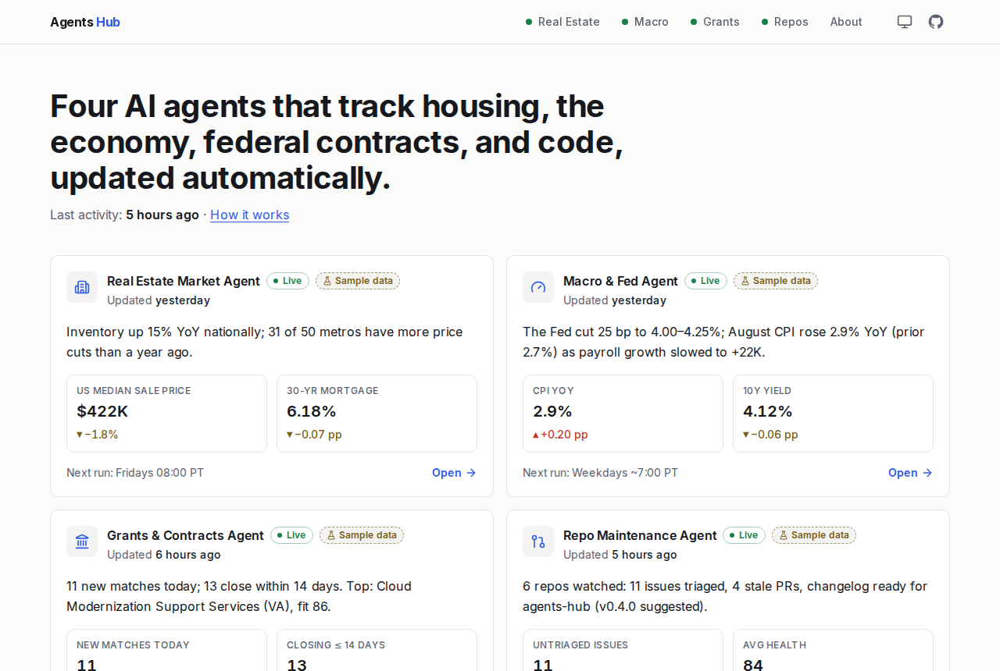
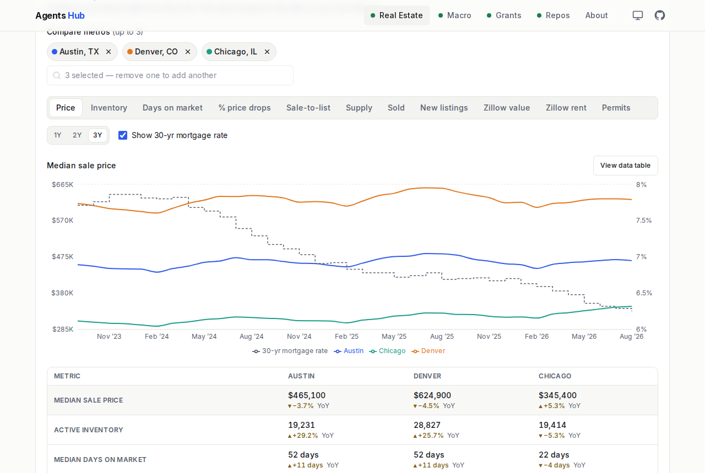
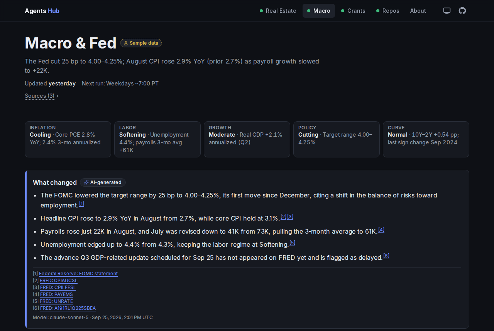
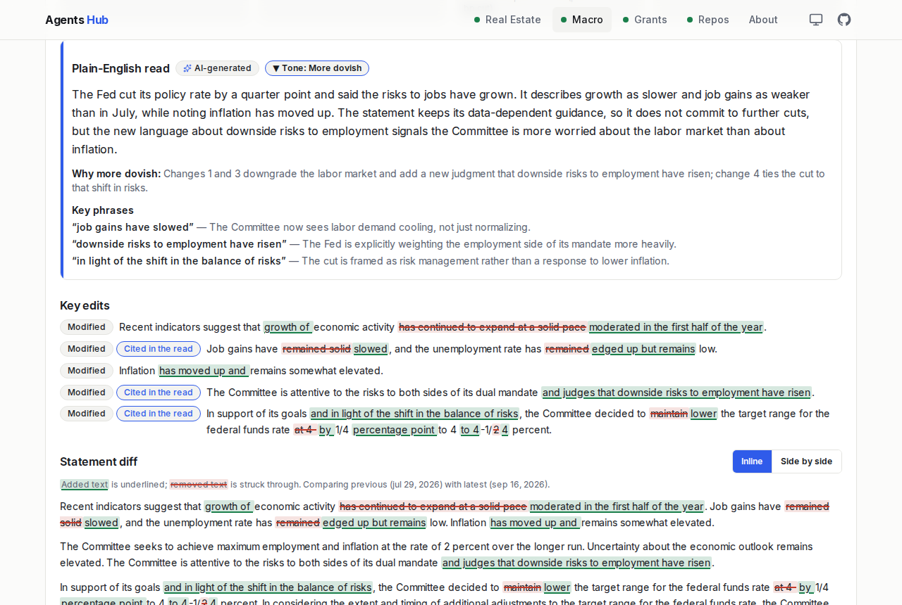
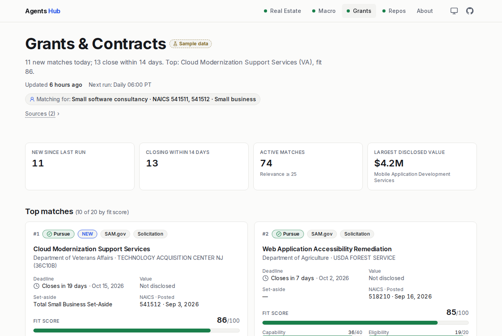
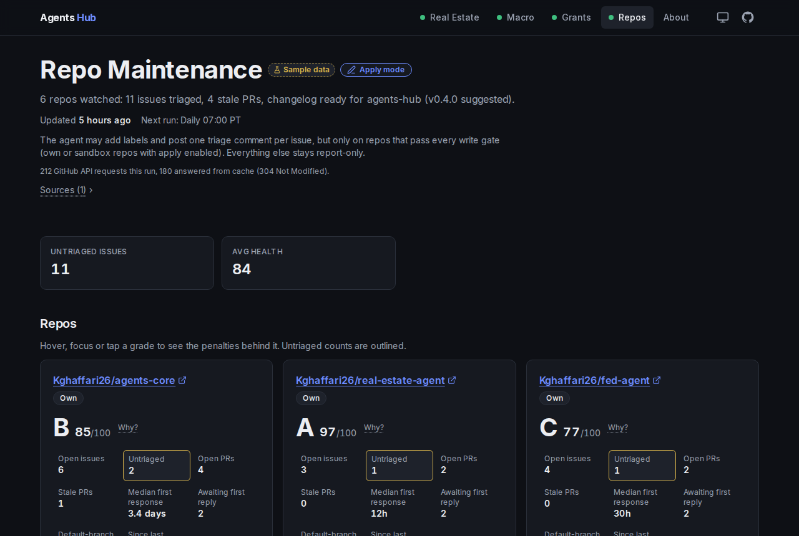
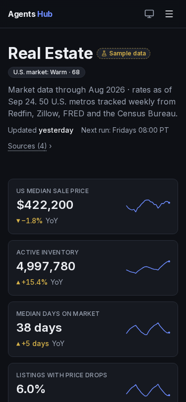

# Agents Hub

**Four autonomous AI agents that track housing, the economy, federal contracts, and code — updated on a schedule, with every number sourced and every LLM dollar published.**

This repo is the website: a static Next.js site on GitHub Pages that assembles the JSON each agent publishes and turns it into dashboards. No server, no database, no secrets in the browser.

| Section                                                              | What it shows                                                                                                                             | Agent repo                                                                |
| -------------------------------------------------------------------- | ----------------------------------------------------------------------------------------------------------------------------------------- | ------------------------------------------------------------------------- |
| [Real Estate](https://kghaffari26.github.io/agents-hub/real-estate/) | 50 U.S. metros: compare up to 3, metric toggles, mortgage-rate overlay, map, movers, alerts, market temperature, affordability calculator | [real-estate-agent](https://github.com/Kghaffari26/real-estate-agent)     |
| [Macro](https://kghaffari26.github.io/agents-hub/macro/)             | Regime strip, 24 indicators with revision badges, yield curve, FOMC decision + word-level statement diff                                  | [fed-agent](https://github.com/Kghaffari26/fed-agent)                     |
| [Grants](https://kghaffari26.github.io/agents-hub/grants/)           | SAM.gov / Grants.gov matches scored against a business profile; filterable table with CSV export; deadline timeline                       | [sam-agent](https://github.com/Kghaffari26/sam-agent)                     |
| [Repos](https://kghaffari26.github.io/agents-hub/repos/)             | Health scores, triage queue, stale PRs with nudges, changelog drafts, actions log                                                         | [repo-maintain-agent](https://github.com/Kghaffari26/repo-maintain-agent) |

All four agents are built on [agents-core](https://github.com/Kghaffari26/agents-core): HTTP caching, a per-run LLM budget cap, a number guard that rejects narrative citing numbers the code didn't compute, and the data-branch publisher.

## Screenshots

| Overview                                   | Real estate explorer                             |
| ------------------------------------------ | ------------------------------------------------ |
|  |  |
| **Macro (dark)**                           | **FOMC statement diff**                          |
|        |      |
| **Grants**                                 | **Repos (dark)**                                 |
|      |              |



## Architecture

```
agent repos (Python, GitHub Actions cron)              agents-hub (this repo)
┌───────────────────────────────┐                      ┌──────────────────────────────────────────┐
│ real-estate-agent  (Fridays)  │  force-push          │ scripts/fetch-data.mjs                   │
│ fed-agent          (weekdays) │  `data` branch  ───▶ │   raw.githubusercontent.com/<repo>/data  │
│ sam-agent          (daily)    │                      │   → public/data/<agent>/  (zod-checked)  │
│ repo-maintain-agent(daily)    │  repository_dispatch │   → manifest.json + costs/summary.json   │
└───────────────────────────────┘  agent-data-updated  │   (fixtures + "Sample data" if missing)  │
                                   ───────────────────▶│ next build (static export) → out/        │
                                                       │ lint · vitest · Playwright + axe · LHCI  │
                                                       │ deploy-pages → GitHub Pages /agents-hub  │
                                                       └──────────────────────────────────────────┘
```

- **Data contract.** Each agent's `data` branch holds `latest.json`, agent-specific files (`metros/<slug>.json`, `all.json`), `history/`, `manifest-entry.json`, `costs-summary.json` and `schema.json` ([agents-core README](https://github.com/Kghaffari26/agents-core#the-data-branch-contract)). The shapes are §6 of each agent spec in [`docs/specs/`](docs/specs/). The site validates every file with zod (`src/lib/schemas/`); build-time loaders throw an error naming the file and field.
- **Never blocked by an agent.** If a data branch is missing or a file fails its contract, `fetch-data` uses that agent's committed fixtures (`test/fixtures/<agent>/`) and the UI shows a **Sample data** badge on that section.
- **Build-time vs lazy data.** Headline numbers and briefs render into HTML at build time; per-metro series, the full grants table and 10-year macro series load client-side on demand through `dataUrl()` (basePath-aware).
- **Performance.** Recharts and Leaflet are code-split and load after first paint; mobile Lighthouse (local, gzip, simulated 4G): 99 on `/`, 92–98 on `/real-estate`, 95+ elsewhere.

### Layout

```
config/sources.json        where each agent publishes (order = overview cards)
scripts/fetch-data.mjs     download data branches → public/data (fixture fallback)
scripts/gen-types.mjs      schema.json → src/types/generated + src/lib/validators/generated
scripts/gen_fixtures.py    deterministic, realistic fixtures for all four agents
scripts/gen-og.mjs         OG images (satori + resvg) · gen-sitemap.mjs · serve-out.mjs
src/app/                   routes: /, /real-estate, /real-estate/[slug], /macro, /grants, /repos, /about
src/components/            shell · common · overview · real-estate · macro · grants · repos · about
src/lib/                   schemas (zod contracts) · data loaders · format · mortgage · urlState · csv · colors
test/                      unit + component + contract tests, fixtures, broken fixtures
e2e/                       Playwright flows + axe on every route in both themes
```

## Develop

```bash
npm ci
npm run fetch-data      # live data branches; falls back to fixtures per agent
npm run dev             # http://localhost:3000
npm test                # vitest (unit, component, contract)
npm run build           # static export to out/
npm run e2e             # Playwright + axe against out/
npm run lint            # eslint + prettier
npm run gen:fixtures    # regenerate test/fixtures (python3)
BASE_PATH=/agents-hub npm run build && BASE_PATH=/agents-hub npm run e2e   # reproduce GitHub Pages paths
```

Adding a fifth agent: an entry in `config/sources.json`, a fixture folder, a zod schema in `src/lib/schemas/`, a route, and a line in `src/lib/nav.ts`.

## Deploy

`.github/workflows/deploy.yml` runs on push to `main`, on `repository_dispatch` (`agent-data-updated`, sent by agents-core's reusable workflow when `site_repo` and `SITE_DISPATCH_TOKEN` are set), every 6 hours, and manually. It fetches data, generates types, lints, tests, builds, runs Playwright + axe, runs Lighthouse CI (warn-only), and deploys to Pages.

## Disclaimer

Not financial, legal, or investment advice. AI-generated summaries may contain errors; every page links to its sources. Data: Redfin, Zillow, FRED, BLS, U.S. Census Bureau, Federal Reserve Board, SAM.gov, Grants.gov, GitHub; map tiles © OpenStreetMap contributors.
